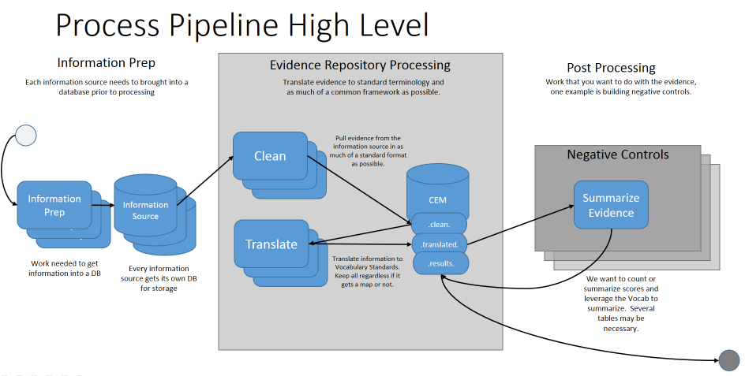

# CommonEvidenceModel

## Introduction
The CommonEvidenceModel (CEM) leverages work previously performed within LAERTES, also known as the OHDSI Knowledgebase.  However the focus here is building infrastructure to update the incoming raw sources as well as the post processing of finding Negative Controls.

 

This project is an offshoot of the OHDSI Knowledgebase which more inforamtion can be found here:
* [https://github.com/OHDSI/KnowledgeBase](https://github.com/OHDSI/KnowledgeBase)
* Boyce RD, Ryan PB, Norén GN, Schuemie MJ, Reich C, Duke J, Tatonetti NP, Trifirò G, Harpaz R, Overhage JM, Hartzema AG, Khayter M, Voss EA, Lambert CG, Huser V, Dumontier M. Bridging islands of information to establish an integrated knowledge base of drugs and health outcomes of interest. Drug Saf. 2014 Aug;37(8):557-67. doi: 10.1007/s40264-014-0189-0. [PubMed PMID: 24985530](https://www.ncbi.nlm.nih.gov/pubmed/24985530); PubMed Central PMCID: PMC4134480.
* Voss EA, Boyce RD, Ryan PB, van der Lei J, Rijnbeek PR, Schuemie MJ. Accuracy of an automated knowledge base for identifying drug adverse reactions. J Biomed Inform. 2017 Feb;66:72-81. doi: 10.1016/j.jbi.2016.12.005. Epub 2016 Dec 16. [PubMed PMID: 27993747](https://www.ncbi.nlm.nih.gov/pubmed/27993747); PubMed Central PMCID: PMC5316295.
* Knowledge Base workgroup of the Observational Health Data Sciences and Informatics (OHDSI) collaborative. Large-scale adverse effects related to treatment evidence standardization (LAERTES): an open scalable system for linking pharmacovigilance evidence sources with clinical data. J Biomed Semantics. 2017 Mar 7;8(1):11. doi: 10.1186/s13326-017-0115-3. PubMed PMID: 28270198; [PubMed Central PMCID: PMC5341176](https://www.ncbi.nlm.nih.gov/pubmed/28270198).

## Data Status

| source_id|description|provenance|contributor_organization|contact_name|creation_date|coverage_start_date|coverage_end_date|version_identifier |
| --- | --- | --- | --- | --- | --- | --- | --- | --- |
| AEOLUS|Spontaneous reports and signals from FDA Adverse Event Reporting System (FAERS) based on the paper Banda, J. M. et al. A curated and standardized adverse drug event resource to accelerate drug safety research. Sci. Data 3:160026 doi: 10.1038/sdata.2016.26 (2016).|AEOLUS|Center for Biomedical Informatics Research, Stanford University|Lee Evans (LTS Computing LLC)|2016-04-22|2004-01-01|2015-06-01|V1 |
| MEDLINE_COOCCURRENCE|Co-occurrence of a drug and condition MeSH tag on a publication pulled from MEDLINE.|MEDLINE|Janssen R&D|Erica Voss|1900-01-01|1900-01-01|1900-01-01|V1 |
| MEDLINE_AVILLACH|Co-occurrence of a drug and condition MeSH tag on a publication with the qualifiers adverse effects and chemically induced respectively.  Based on publication Avillach P, Dufour JC, Diallo G, Salvo F, Joubert M, Thiessard F, Mougin F, Trifiro G, Fourrier-Reglat A, Pariente A, Fieschi M. Design and validation of an automated method to detect known adverse drug reactions in MEDLINE: a contribution from the EU-ADR project. J Am Med Inform Assoc. 2013 May 1;20(3):446-52. doi: 10.1136/amiajnl-2012-001083. Epub 2012 Nov 29. PubMed PMID: 23195749; PubMed Central PMCID: PMC3628051.|MEDLINE|Janssen R&D|Erica Voss|1900-01-01|1900-01-01|1900-01-01|V1 |
| MEDLINE_PUBMED|Co-occurrence of a drug and condition MeSH tag or found in the Title of Abstract of a publication.  Leverages Pubmed.|PUBMED|Janssen R&D|Erica Voss|1900-01-01|1900-01-01|1900-01-01|V1 |
| MEDLINE_WINNENBURG|Winnenburg R, Sorbello A, Ripple A, Harpaz R, Tonning J, Szarfman A, Francis H, Bodenreider O. Leveraging MEDLINE indexing for pharmacovigilance - Inherent limitations and mitigation strategies. J Biomed Inform. 2015 Oct;57:425-35. doi: 
10.1016/j.jbi.2015.08.022. Epub 2015 Sep 2. PubMed PMID: 26342964; PubMed Central PMCID: PMC4775467.|MEDLINE|Janssen R&D|Erica Voss|1900-01-01|1900-01-01|1900-01-01|V1 |
| SEMMEDDB|Semantic Medline uses natural language processing to extract semantic predictions from titles and text.  H. Kilicoglu et al., Constructing a semantic predication gold standard from the biomedical literature, BMC Bioinformatics 12 (2011) 486.|SEMMEDDB|National Institutes of Health|National Institutes of Health|2016-12-31|1865-01-01|2016-12-31|V30 |
| SPLICER|Adverse drug reactions extracted from the Adverse Reactions or Post Marketing section of United States product labeling. Basd on publication J. Duke, J. Friedlin, X. Li, Consistency in the safety labeling of bioequivalent medications, Pharmacoepidemiol. Drug Saf. 22 (3) (2013) 294?301.|SPLICER|Regenstrief Institute|Jon Duke|1900-01-01|1900-01-01|1900-01-01|V |
| EU_PL_ADR|From the PROTECT ADR database, this provided a list of ADRS on Summary of Product Characteristics (SPC) of products authorized in the European Union.  Pharmacoepidemiological Research on Outcomes of Therapeutics by a European Consortium (PROTECT), Adverse Drug Reactions Database, [webpage] (2015.05.07), Available from: <http://www.imi-protect.eu/adverseDrugReactions.shtml>|EU_PL_ADR|PROTECT|PROTECT|2015-05-30|1900-01-01|2015-05-30|20150630 |

## Features

### Post Processing - Negative Controls
To learn more about the negative controls processing please refer to the following:
 - [Preparatory Steps](https://github.com/OHDSI/CommonEvidenceModel/blob/negativeControlReadMe/postProcessingNegativeControlsPrep/README.md)
 - [Obtaining Negative Controls from ATLAS](https://github.com/OHDSI/CommonEvidenceModel/blob/negativeControlReadMe/postProcessingNegativeControls/README-ATLAS.md)

## Technology

## System Requirements

## Dependencies

## Getting Started

## Getting Involved
* Join the [Working Group](http://www.ohdsi.org/web/wiki/doku.php?id=projects:workgroups:kb-wg) 
* Developer questions/comments/feedback: <a href="http://forums.ohdsi.org/c/developers">OHDSI Forum</a>
* We use the <a href="../../issues">GitHub issue tracker</a> for all bugs/issues/enhancements

## License

## Development
