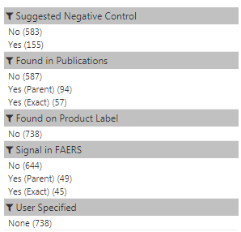

# Obtaining Negative Controls from ATLAS

## Introduction
If you are using ATLAS release 2.4.0 or higher you can generate negative controls.  The tool is set up for use in the public OHDSI ATLAS however can be configured internally.

## Instructions
1. Navigate to [OHDSI ATLAS](http://www.ohdsi.org/web/atlas/)
2. Create a concept set with your exposure or conditions of interest.  
	 - The list should either be drugs or conditions; given drugs you will receive condition negative controls and given conditions you’ll receive drug negative controls.
	 - You want to generate one list of negative controls for all exposures or conditions of interest.  No need to generate separate concept sets for each exposure or condition of interest, put them all together in one list.
3. Within you concept set, navigate to the “Explore Evidence” tab.  
 
4. On the “Explore Evidence” tab there are two optional "Generation Settings": to note concepts to include and concepts to exclude.  In order to add concepts to these lists, generate a "Concept Set" and then add that concept set to the include/exclude option using the folder icon.  
 
	- **What concepts do you want to include as known negative controls? (Optional)** - If you already have a list of concepts you know you would like to use, add them here.  Note that this does not force concepts into the list, it merely highlights concepts that you already believe are good.  The process may also note the concept you wanted to include is not a good negative control.  Adding concepts here is for information purposes only.
	- **What concepts do you want to exclude as known positive controls? (Optional)** - If you already have a list of concepts you know you would like to exclude, add them here.  For example, concepts used within your cohort definition are good concepts to consider adding to the exclude list.  Excluded concepts defined by the users will be eliminated from consideration as good negative controls regardless of what the system believes.  
5. Hit the "Generate Button", it may take several moments to generate your list however the system will communicate its status while doing so.
6. Once the "Generation Status" is listed as "COMPLETE", hit the "View Evidence" button. 
 
7. A list all concept considered will be displayed below the "View Evidence" button:
 - *Left Hand Navigation*  
    
  This can be used to filter the results.  
	- "Suggested Negative Control" allows users to filter to just items that the system deems to be good negative controls.  
	- "Found in Publications" allows user to filter publication evidence.  
	- "Found on Product Label" allows user to filter product label evidence.
	- "Signal in FAERS" allows user to filter on spontaneous report information.
	- "User Specified" allows user to filter to conditions specified above as concepts to include.
 - *Record Counts*  
    
   There are two columns in the evidence, one for "RC" which stands for "record counts" and another "DRC" which stands for "descendant record counts".  These columns will show you how often the exact concept appears in your data (i.e. RC) and how often the concept and its descendants show up in your data (i.e. DRC).  The drop down allows you to select your data set to use to show these counts.  If you are using the public OHDSI ATLAS it is using [SYNPUF](https://www.cms.gov/Research-Statistics-Data-and-Systems/Downloadable-Public-Use-Files/SynPUFs/DE_Syn_PUF.html) a synthetic data set, in this case the counts are meaningless.
 - *Table of Results* - the table shows the evidence generated from the CommonEvidenceModel for your concept set.  Column details can be found in the "Columns of Evidence" section below.
 - *Column visibility*  
     
	Not all columns are shown by default however they can be exposed by hitting the "Column Visibility" and selecting the columns of interest. 
 - *Exporting Results* - press the CSV button to export the results.
 - *Save New Concept Set From Selection Below* - you can create a concept set from the list, it will only select concepts that are being shown (e.g. if you filter to Suggested Negative Control = "Yes" and press the button to save as new concept set, it will save the filtered concepts to the list)

## Columns of Evidence
| Column | Description |
| --- | --- |
| ID | OMOP CONCEPT_ID reviewed for evidence. |
| Name | OMOP CONCEPT_NAME reviewed for evidence. |
| Domain | What the concept belongs to, this will either be condition or drug (however it is possible a concept moved domain and if they are not in the domain of interest do not use). |
| Suggested Negative Control | A list of suggested negative controls based on the following: <ul><li>have no published literature association between the drug-condition pair of interest, either exactly as the evidence was mapped, a lower lever concept contained evidence, a direct parent concept contained evidence, or an ancestor contained evidence.</li><li>not existing on the product label, either exactly as the evidence was mapped, a lower lever concept contained evidence, a direct parent concept contained evidence, or an ancestor contained evidence.</li><li>not considered a FAERS signal, either exactly as the evidence was mapped, a lower lever concept contained evidence, a direct parent concept contained evidence, or an ancestor contained evidence.</li><li>have no indication or contraindication listed in the OMOP Vocabulary for the pair.</li><li>are not considered a broad concepts.</li><li>are not considered a drug induced concept.</li><li>not considered a pregnancy related concept.</li><li>was not suggested to be excluded by the user.</li><li>was not optimized out, meaning another parent concept existed that was also considered a good negative, so the lower level concept was excluded.</li></ul> All information known about the drug-condition pair is provided so if the user wishes to loosen this criteria they can (i.e. ignore evidence from ancestor restrictions).|
| Sort Order | In the [Negative Controls Prep of a Concept Universe](https://github.com/OHDSI/CommonEvidenceModel/tree/negativeControlReadMe/postProcessingNegativeControlsPrep#concept-universe) processing of the CommonEvidenceModel and order is generated off patient level data.  It is meant to give the user a perspective on order of importance and has been abstracted to 1 through N.|
| Publication Count (Descendant Concept Match) | For descendants of this concept, how many publications exist. |
| Publication Count (Exact Concept Match) | For this concept, how many publications exist. |
| Publication Count (Parent Concept Match) | For parents of this concept, how many publications exist. |	
| Publication Count (Ancestor Concept Match) | For ancestors of this concept, how many publications exist. |
| Indicated | Does the OMOP Vocabulary associate this drug and condition in an “indication” or "contraindication" relationship? |	
| Broad Concept | Is this concept determined to be [too broad](https://github.com/OHDSI/CommonEvidenceModel/tree/negativeControlReadMe/postProcessingNegativeControlsPrep#broad-concepts) for use? |	
| Drug Induced Concept | Is this a concept already suggesting an [association between a drug and condition](https://github.com/OHDSI/CommonEvidenceModel/tree/negativeControlReadMe/postProcessingNegativeControlsPrep#drug-related) and should be avoided? |	
| Pregnancy Concept | Is this concept [related to pregnancy](https://github.com/OHDSI/CommonEvidenceModel/tree/negativeControlReadMe/postProcessingNegativeControlsPrep#pregnancy-conditions) and should be avoided? |	
| Product Label Count (Descendant Concept Match) | For descendants of this concept, does the US structure product label suggest that this drug and condition are in an adverse event. |	
| Product Label (Exact Concept Match) | For this concept, does the US structure product label suggest that this drug and condition are in an adverse event. |	
| Product Label (Parent Concept Match) | For parents of this concept, does the US structure product label suggest that this drug and condition are in an adverse event. |	
| Product Label (Ancestor Concept Match) | For ancestors of this concept, does the US structure product label suggest that this drug and condition are in an adverse event. |	
| FAERS Count (Descendant Concept Match) | For descendants of this concept, do spontaneous reports from the US FAERS system suggest there a possible signal (PRR >= 2, case count >= 3, and chi-squared >= 4) ([Evans et al](https://www.ncbi.nlm.nih.gov/pubmed/11828828)). |	
| FAERS Count (Exact Concept Match | For this concept, do spontaneous reports from the US FAERS system suggest there a possible signal (PRR >= 2, case count >= 3, and chi-squared >= 4) ([Evans et al](https://www.ncbi.nlm.nih.gov/pubmed/11828828)). |	
| FAERS Count (Parent Concept Match) |  For parents of this concept, do spontaneous reports from the US FAERS system suggest there a possible signal (PRR >= 2, case count >= 3, and chi-squared >= 4) ([Evans et al](https://www.ncbi.nlm.nih.gov/pubmed/11828828)).  |	
| FAERS Count (Ancestor Concept Match) |  For ancestors of this concept, do spontaneous reports from the US FAERS system suggest there a possible signal (PRR >= 2, case count >= 3, and chi-squared >= 4) ([Evans et al](https://www.ncbi.nlm.nih.gov/pubmed/11828828)).  |	
| User Excluded | Identifies any concepts the user added to the interface to exclude.  This will eliminate the concept from consideration as a negative control. |	
| User Included | Identifies any concepts the user added to the interface to include.  This is for information purposes only, it does not affect the processing and does not add the concept if it was not considered by the system.  |	
| Optimized Out | A concept is removed from consideration if a parent concept already exists on the list as defined by the OMOP Vocabulary. |	
| Not Prevalent | Excluded concept if not considered prevalent enough in the data. |	
| RC | "RC" which stands for "record counts" and shows the users how often the exact concept appears in in the selected database. |	
| DRC  | "DRC" which stands for "descendant record counts" and shows how often the concept and its descendants show up in the selected database. |

## Getting Involved
Refer <a href="../../../#getting-involved">here</a>.

Contact Erica Voss, Anthony Sena, or Lee Evans support in generating negative controls in your local ATLAS environment.

## References

1. Evans SJ, Waller PC, Davis S. Use of proportional reporting ratios (PRRs) for signal generation from spontaneous adverse drug reaction reports. Pharmacoepidemiol Drug Saf. 2001 Oct-Nov;10(6):483-6. PubMed PMID: 11828828.